# Chef AI Application Architecture

This document provides visual diagrams of the Chef AI application architecture, including all workflows and user interactions.

**Last Updated**: 2025-12-06 12:33:26

---

## Table of Contents

1. [Streamlit Multi-Page Application](#streamlit-multi-page-application)
2. [Orchestrator Workflow](#orchestrator-workflow)
3. [Fetch Recipes Workflow (LLM-Generated SQL)](#fetch-recipes-workflow)
4. [Catalog Recipe Workflow](#catalog-recipe-workflow)
5. [System Overview](#system-overview)
6. [Database Schema](#database-schema)

---

## Streamlit Multi-Page Application

The Chef AI app is a multi-page Streamlit application with continuous chat and recipe browsing capabilities.

### Pages:

#### 💬 Chat Page
- **Continuous conversation** with message history
- **Voice input** using st.audio_input + Whisper
- **Text-to-speech** responses with Edge TTS
- **Chat history persistence** across interactions
- **Clear history** button in sidebar

#### 📚 Recipe Library Page
- **Grid layout** of all recipes
- **Star/unstar** favorites (persisted to database)
- **Advanced filters**: difficulty, cuisine, max time
- **Search** by name or ingredient
- **Expandable recipe cards** with full details

```mermaid
graph TD
    Start([User Opens App]) --> Pages{Navigate Pages}

    Pages -->|Chat| ChatPage[💬 Chat Page]
    Pages -->|Library| LibraryPage[📚 Recipe Library Page]

    %% Chat Page Flow
    ChatPage --> ChatInput{Input Method}
    ChatInput -->|Voice| VoiceRecord[🎤 Record Audio]
    ChatInput -->|Text| TextInput[⌨️ Type Message]

    VoiceRecord --> Whisper[OpenAI Whisper: Transcribe]
    Whisper --> AddToHistory1[Add to Chat History]
    TextInput --> AddToHistory1

    AddToHistory1 --> InvokeOrch[Invoke Orchestrator Agent]
    InvokeOrch --> GetResponse[Get Response]
    GetResponse --> AddToHistory2[Add Response to Chat History]
    AddToHistory2 --> DisplayChat[Display Chat Messages]

    DisplayChat --> TTSOption{Read Aloud?}
    TTSOption -->|Yes| EdgeTTS[Edge TTS: Generate Audio]
    EdgeTTS --> PlayAudio[Play Audio]
    PlayAudio --> ChatContinue([Continue Chat])
    TTSOption -->|No| ChatContinue

    ChatContinue --> ClearChat{Clear History?}
    ClearChat -->|Yes| ResetChat[Reset Session State]
    ResetChat --> ChatPage
    ClearChat -->|No| ChatInput

    %% Library Page Flow
    LibraryPage --> LoadRecipes[Load All Recipes from DB]
    LoadRecipes --> LoadStars[Load Starred Recipes]
    LoadStars --> ApplyFilters[Apply Filters & Search]

    ApplyFilters --> DisplayGrid[Display Recipe Grid]
    DisplayGrid --> StarAction{Star/Unstar?}
    StarAction -->|Yes| UpdateDB[Update starred_recipes Table]
    UpdateDB --> RefreshGrid[Refresh Display]
    RefreshGrid --> DisplayGrid

    StarAction -->|No| ExpandRecipe{View Details?}
    ExpandRecipe -->|Yes| ShowDetails[Show Ingredients & Instructions]
    ShowDetails --> LibraryContinue([Continue Browsing])
    ExpandRecipe -->|No| LibraryContinue

    LibraryContinue --> ChangeFilters{Change Filters?}
    ChangeFilters -->|Yes| ApplyFilters
    ChangeFilters -->|No| Pages

    style Start fill:#e1f5e1
    style InvokeOrch fill:#ffe1e1
    style UpdateDB fill:#ffe1e1
    style EdgeTTS fill:#e1e5ff
    style Whisper fill:#e1e5ff
    style ChatContinue fill:#ffe1f5
    style LibraryContinue fill:#ffe1f5
```



### Key Features:
- **Multi-page navigation** via sidebar
- **Session state persistence** for chat and stars
- **Real-time updates** with st.rerun()
- **Database integration** for starred recipes

---

## Orchestrator Workflow

The orchestrator routes user requests to the appropriate sub-workflow.

### Routing Logic:
1. **Classify Intent**: Determines if user wants to:
   - `fetch_recipes`: Search for recipes, ask questions
   - `catalog_recipe`: Add a new recipe from URL
2. **Route to Handler**: Invokes appropriate workflow
3. **Return Response**: Unified response format for UI


### Intent Classification:
- **fetch_recipes**: "I have chicken", "Show me pasta recipes", "How many recipes?"
- **catalog_recipe**: "Add this recipe: https://...", Contains a URL

---

## Fetch Recipes Workflow

**New simplified architecture using LLM-generated SQL with security validation.**

### Workflow Steps:
1. **Generate SQL Query**: LLM creates custom SQL based on user question
2. **Judge SQL Query**: Multi-layer security validation
   - SQL injection detection
   - Structure validation (SELECT only)
   - Schema validation (tables/columns exist)
3. **Execute Query**: Run validated SQL against database
4. **Analyze Results**: LLM converts SQL results to natural language
5. **Retry Loop**: Up to 3 retries if validation fails


### Key Features:
- **Universal query handling**: No predefined query patterns
- **Security-first**: SQL judge prevents injection attacks
- **Self-correcting**: Retry loop with error feedback
- **Natural language**: Ask anything about your recipes
- **Smart SQL generation**: Handles complex queries with JOINs, aggregations, etc.

### Query Examples:
- "I have chicken and garlic" → Ingredient matching with JOIN
- "Show me easy Italian recipes" → Multi-condition WHERE clause
- "How many recipes?" → COUNT aggregation
- "What's the average cook time?" → AVG function
- "Most common ingredients?" → GROUP BY with COUNT

---

## Catalog Recipe Workflow

This LangGraph workflow extracts recipes from URLs and adds them to the database.

### Workflow Steps:
1. **Fetch Webpage**: Downloads HTML from recipe URL
2. **Parse JSON-LD**: Attempts to extract structured Recipe schema (preferred)
3. **Extract with LLM**: Fallback to AI extraction if JSON-LD not available
4. **Validate Recipe Data**: Ensures all required fields are present
5. **Save to Database**: Persists recipe with ingredients and relationships


### Key Features:
- **Dual extraction**: Structured data first, AI parsing fallback
- **Comprehensive validation**: Data quality checks
- **Smart categorization**: AI categorizes ingredients
- **URL preservation**: Stores source for reference

---

## System Overview

### Complete Architecture:

```mermaid
graph TB
    User([User]) -->|Interact| Streamlit[Streamlit Multi-Page App]

    subgraph "Streamlit Pages"
        ChatPage[💬 Chat Page]
        LibraryPage[📚 Recipe Library]
    end

    Streamlit --> ChatPage
    Streamlit --> LibraryPage

    ChatPage -->|Voice| Whisper[OpenAI Whisper]
    Whisper -->|Text| ChatPage

    ChatPage -->|User Query| Orchestrator[Orchestrator Agent]

    Orchestrator -->|Route| FetchRecipes[Fetch Recipes Agent]
    Orchestrator -->|Route| CatalogRecipe[Catalog Recipe Agent]

    FetchRecipes -->|Generate SQL| SQLJudge[SQL Judge/Validator]
    SQLJudge -->|Valid SQL| Database[(SQLite DB)]
    Database -->|Results| FetchRecipes
    FetchRecipes -->|LLM Analysis| ChatPage

    CatalogRecipe -->|Fetch| WebPage[Recipe Webpage]
    WebPage -->|HTML| CatalogRecipe
    CatalogRecipe -->|Parse/Extract| LLM[OpenAI GPT]
    LLM -->|Structured Data| CatalogRecipe
    CatalogRecipe -->|Insert| Database

    LibraryPage -->|Query| Database
    Database -->|Recipes + Stars| LibraryPage
    LibraryPage -->|Toggle Star| Database

    ChatPage -->|TTS| EdgeTTS[Edge TTS]
    EdgeTTS -->|Audio| User

    style User fill:#e1f5e1
    style Database fill:#ffe1e1
    style LLM fill:#e1e5ff
    style Whisper fill:#e1e5ff
    style EdgeTTS fill:#e1e5ff
    style SQLJudge fill:#ffcc00
    style Orchestrator fill:#ff9999
```



### Technology Stack:

**Frontend:**
- Streamlit (multi-page Python web UI)
- Chat interface with message history
- Grid-based recipe library

**Agents/Workflows:**
- LangGraph (orchestration framework)
- Orchestrator (intent routing)
- Fetch Recipes (LLM-generated SQL)
- Catalog Recipe (web scraping + extraction)

**LLM Services:**
- OpenAI GPT-4o-mini (SQL generation, analysis, extraction)
- OpenAI Whisper (speech-to-text)
- Edge TTS (text-to-speech)

**Data Layer:**
- SQLite (recipes, ingredients, starred recipes)
- SQL Judge (security validation)

**Web Scraping:**
- BeautifulSoup, Requests (HTML parsing)
- Playwright (dynamic content)

---

## Database Schema


### Tables:
- **users**: User accounts (default user_id=1)
- **recipes**: Recipe information with metadata
- **ingredients**: Unique ingredients with categories
- **recipe_ingredients**: Many-to-many relationship
- **starred_recipes**: User's favorite recipes (NEW!)

---

## User Journeys

### Journey 1: Finding a Recipe

1. **User opens Chat page**
2. **User asks**: "I have chicken and garlic, what can I make?"
3. **Orchestrator** routes to `fetch_recipes`
4. **Fetch Recipes**:
   - LLM generates: `SELECT r.*, ... FROM recipes r JOIN ... WHERE ingredients IN ('chicken', 'garlic')`
   - SQL Judge validates query (✅ PASS)
   - Executes query → 2 matching recipes
   - LLM analyzes: "I found 2 recipes you can make! Chicken Stir Fry (90% match)..."
5. **Chat displays**: Conversational response with recipe details
6. **User clicks** "Read aloud" → Edge TTS plays audio

### Journey 2: Browsing Library

1. **User navigates to Recipe Library**
2. **Page loads**: 5 recipes displayed in grid
3. **User filters**: Difficulty = "easy", Cuisine = "Italian"
4. **Grid updates**: Shows 1 recipe (Caprese Salad)
5. **User stars** the recipe → Saved to database
6. **User checks** "Show starred only" → Only starred recipes shown

### Journey 3: Adding a Recipe

1. **User asks in Chat**: "Add this recipe: https://example.com/carbonara"
2. **Orchestrator** routes to `catalog_recipe`
3. **Catalog Recipe**:
   - Fetches webpage
   - Extracts JSON-LD schema
   - Validates data
   - Saves to database
4. **Chat displays**: "✅ Successfully added 'Carbonara' to the database!"
5. **Recipe appears** in Library on next refresh

---

## Security Features

### SQL Judge (Fetch Recipes)

**Multi-layer validation:**
1. **Pattern Detection**: Blocks DROP, DELETE, UPDATE, INSERT, UNION, etc.
2. **Structure Validation**: Only SELECT queries allowed
3. **Schema Validation**: Verifies tables/columns exist
4. **Retry Loop**: Up to 3 attempts with error feedback

**Example blocked query:**
```sql
User: "How many recipes? DROP TABLE recipes; --"
LLM Generates: "SELECT COUNT(*) FROM recipes"
Judge: ✅ PASS (malicious intent ignored)
```

### Input Validation (Catalog Recipe)

- URL validation before fetching
- HTML sanitization
- Required field checks
- Type validation for numeric fields

---

## Performance Considerations

### Chat Page
- **Message history**: Stored in session state (memory-only)
- **Streaming**: Not yet implemented (future enhancement)
- **Caching**: LLM responses not cached (generates fresh each time)

### Library Page
- **Database queries**: Runs on each page load
- **Filtering**: Client-side (in Python after DB load)
- **Stars**: Persisted to database immediately

### LLM Calls per Query
- **Fetch Recipes**: 2 calls (generate SQL + analyze results)
- **Catalog Recipe**: 1-2 calls (extraction + validation)
- **Orchestrator**: 1 call (intent classification)

---

## Future Enhancements

### Potential Improvements:
- [ ] Streaming LLM responses in chat
- [ ] Query result caching
- [ ] User authentication
- [ ] Recipe sharing/export
- [ ] Meal planning features
- [ ] Shopping list generation
- [ ] Nutrition information
- [ ] Recipe ratings and reviews
- [ ] Multi-user support with separate favorites

---

**Generated on**: 2025-12-06 12:33:26

**Version**: 2.0 (Simplified SQL Architecture + Multi-Page UI)
